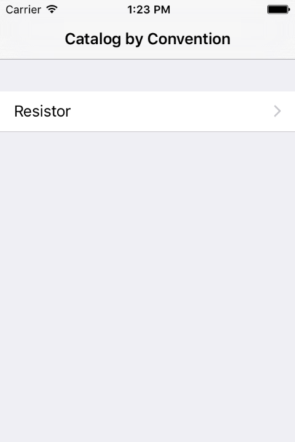
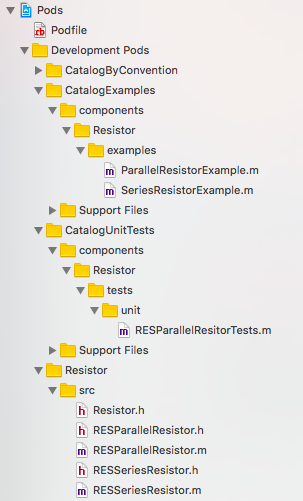

# Catalog by Convention

Catalog by Convention is a set of runtime tools and conventions designed for the development of a
collection of Objective-C and Swift "components".

## Overview

If your team works on many components simultaneously then you may find that building examples and
unit tests involves some non-trivial overhead:

- Maintenance of each component's Xcode projects.
- Maintenance of each component's examples and testing target.
- Switching between projects/targets/workspaces.

One solution to this problem is to create what's called a "Catalog" app. A Catalog's purpose is to
demonstrate the usage of a collection of components in one app. A Catalog application reduces the
number of distinct Xcode targets your team has to interact with. Your team manages your Catalog's
Xcode project, adding and updating files as necessary.

What if — instead of managing an Xcode project — you simply had to create new source files and run
`pod install`?

Catalog by Convention minimizes the engineering overhead of creating **examples** and **unit tests**
using a combination of conventions and CocoaPods. Simply run `pod install` and your Catalog will
include all examples and unit tests in two easy to access targets.

The only remaining engineering burden is to actually write the examples and tests.

### An example

An example Catalog is located within the `example/` directory. Run pod install to set it up:

    pod install --project-directory=example/
    open example/Catalog.xcworkspace

Open the project and you'll find two targets: Catalog and UnitTests. Run the Catalog.

You can navigate through to the single component's examples in the catalog application.

Now try running the unit tests. You'll see the one Resistor test appear in the unit test output.

**Quick introduction to adding a new example**

Open the following directory:

    open example/components/Resistor/examples/

1. Make a duplicate of either example.
2. Open the duplicate and give the class a unique name.
3. Change the `+catalogBreadcrumbs` path to something unique.
4. Run `pod install --project-directory=example/` and rebuild the app.
5. Your example will now be listed under Resistor.

These five steps describe the end-to-end process for adding new examples to the catalog.

**Quick introduction to adding a new test**

Open the following directory:

    open example/components/Resistor/tests/unit/

1. Make a duplicate of either test.
2. Open the duplicate and give the class a unique name.
3. Run `pod install --project-directory=example/` and rebuild the app.
4. Run the unit tests.

## Setup guide

This guide will walk you through how to create a Catalog project that uses the CatalogByConvention
library.

### Step 1: Plan out your component conventions

This is the most important step. What matters most here is that you apply the convention
consistently across each of your components.

Let's look at the convention followed by the example included in the `example/` directory:

    components/
      ComponentNameCamelCased/
        examples/
          SomeExample.m
        src/
          Resistor.h
          RESClass.h
          RESClass.m
        tests/
          unit/
            SomeUnitTest.m

### Step 2: Create the necessary files/folders

Alongside the `components/` directory we'll create the following:

- A `catalog/` directory.
- A `CatalogExamples.podspec`
- A `CatalogUnitTests.podspec`
- A `Podfile`

The final result will look like so:

    catalog/
    components/
    CatalogExamples.podspec
    CatalogUnitTests.podspec
    Podfile

### Step 3: Create the convention podspecs

Let's look at the contents of `CatalogExamples.podspec` and `CatalogUnitTests.podspec`.

Within `CatalogExamples.podspec`:

    Pod::Spec.new do |s|
      s.name         = "CatalogExamples"
      s.version      = "1.0.0"
      s.summary      = "Convention for catalog examples."
      s.homepage     = "https://github.com/your/repo"
      s.authors      = "Catalog"
      s.license      = 'Apache 2.0'
      s.source       = { :git => "https://github.com/your/repo.git", :tag => s.version.to_s }
      s.requires_arc = true
      
      # Conventions
      s.source_files = 'components/*/examples/*.{h,m,swift}'
      s.public_header_files = 'components/*/examples/*.h'
      s.resources = ['components/*/examples/resources/*']
    end

Within `CatalogUnitTests.podspec`:

    Pod::Spec.new do |s|
      s.name         = "CatalogUnitTests"
      s.version      = "1.0.0"
      s.summary      = "Convention for catalog tests."
      s.homepage     = "https://github.com/your/repo"
      s.authors      = "Catalog"
      s.license      = 'Apache 2.0'
      s.source       = { :git => "https://github.com/your/repo.git", :tag => s.version.to_s }
      s.requires_arc = true
      s.framework = 'XCTest'
      
      # Conventions
      s.source_files = 'components/*/tests/unit/*.{h,m,swift}'
      s.resources = ['components/*/tests/unit/resources/*']
      
      # Unit tests require you to specify your components as dependencies.
      s.dependency 'Resistor'
    end

### Step 4: Create a Podfile for your catalog

Now let's edit the `Podfile`.

Feel free to use the following as a template, updating the names of targets, paths, and dependencies
where applicable.

    abstract_target 'Catalog' do
      workspace 'Catalog.xcworkspace'
    	use_frameworks! 
      
    	pod 'CatalogByConvention'
      
      # Define where the local pods live. This allows your conventions to depend on them.
      pod 'Resistor', :path => 'components/Resistor'
      
    	target "Catalog" do
    		project 'catalog/Catalog.xcodeproj'
        pod 'CatalogExamples', :path => './'
    	end
      
    	target "UnitTests" do
    		project 'catalog/UnitTests.xcodeproj'
        pod 'CatalogUnitTests', :path => './'
    	end
    end

### Step 5: Create the Catalog Xcode project

Create a new Xcode project. We'll assume you're using the "Single View Application" template.

Delete the default ViewController class.

Update your app delegate to look like the following:

    import UIKit
    import CatalogByConvention
    
    @UIApplicationMain
    class AppDelegate: UIResponder, UIApplicationDelegate {
      
      var window: UIWindow?
      
      func application(application: UIApplication, didFinishLaunchingWithOptions launchOptions: [NSObject: AnyObject]?) -> Bool {
        self.window = UIWindow(frame: UIScreen.mainScreen().bounds)
        
        let rootViewController = CBCNodeListViewController(node: CBCCreateNavigationTree())
        rootViewController.title = "Catalog by Convention"
        
        let navController = UINavigationController(rootViewController: rootViewController)
        self.window?.rootViewController = navController
        
        self.window!.makeKeyAndVisible()
        return true
      }
    }

### Step 6: Run pod install

Run `pod install` for your Catalog. Open your Catalog's workspace.

    pod install
    open Catalog.xcworkspace

All of your examples, unit tests, and component source code will be found within the Pods project
in your workspace.

### Step 6: Build!

From this point forward you simply need to create new example and unit test source files and they'll
be picked up on a subsequent pod install.

## License

Licensed under the Apache 2.0 license. See LICENSE for details.
